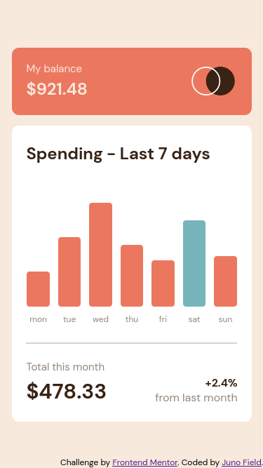
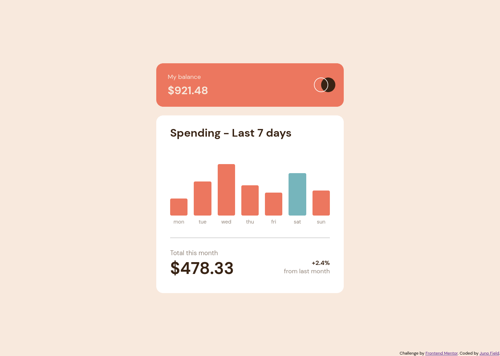

# Frontend Mentor - Expenses chart component solution

This is a solution to the [Expenses chart component challenge on Frontend Mentor](https://www.frontendmentor.io/challenges/expenses-chart-component-e7yJBUdjwt). Frontend Mentor challenges help you improve your coding skills by building realistic projects. 

## Table of contents

- [Overview](#overview)
  - [The challenge](#the-challenge)
  - [Screenshot](#screenshot)
  - [Links](#links)
- [My process](#my-process)
  - [Built with](#built-with)
  - [What I learned](#what-i-learned)
  - [Continued development](#continued-development)
  - [Useful resources](#useful-resources)
- [Author](#author)
- [Acknowledgments](#acknowledgments)

## Overview

### The challenge

Users should be able to:

- View the bar chart and hover over the individual bars to see the correct amounts for each day
- See the current day’s bar highlighted in a different colour to the other bars
- View the optimal layout for the content depending on their device’s screen size
- See hover states for all interactive elements on the page
- **Bonus**: Use the JSON data file provided to dynamically size the bars on the chart

### Screenshot

#### Mobile

#### Desktop

### Links

- Solution URL: [https://github.com/JunoField/fmj1-expenses-chart-component](https://github.com/JunoField/fmj1-expenses-chart-component
- Live Site URL: [https://junofield.github.io/fmj1-expenses-chart-component](https://junofield.github.io/fmj1-expenses-chart-component)

## My process

### Built with

- Semantic HTML5 markup
- CSS with custom properties
- Flexbox
- Mobile-first workflow
- JavaScript with HTML DOM and JSON data processing

### Continued development

In terms of general HTML and CSS, I would say that this project went well. The main thing I'd like to practice is JSON and using it along with JS to visualise data on the site.

### Useful resources

- [https://dmitripavlutin.com/javascript-fetch-async-await/#2-fetching-json](https://dmitripavlutin.com/javascript-fetch-async-await/#2-fetching-json) - Accessing the JSON file was a little more confusing that expected, simply because it runs asynchronously and subsequent code always runs before the file is loaded. This article helped with this issue.
- [https://flexbox.malven.co/](https://flexbox.malven.co/) - This project used flexbox a *lot*. Despite me being somewhat experienced with flex, I still find myself having to refer back to cheat sheets. This one is one of the nicer ones I've found.

### Author

- GitHub - [JunoField](https://github.com/JunoField)
- Frontend Mentor - [@JunoField](https://www.frontendmentor.io/profile/JunoField)
